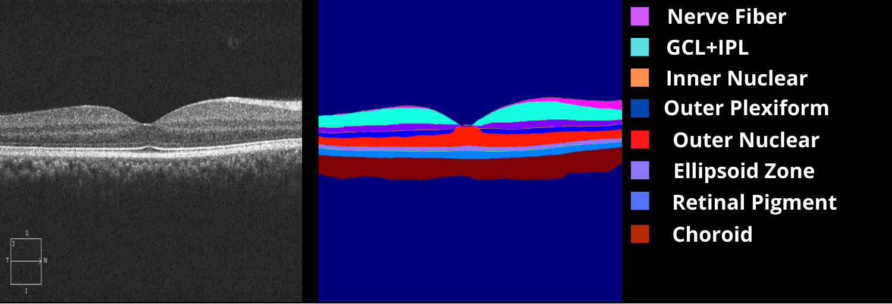

# OCT Retina Layer Segmentation

Deep learning-based multiclass semantic segmentation of retinal layers in Optical Coherence Tomography scans.

## Dataset
The dataset used in this project is the **OCT Image Database (OCTID)** from the University of Waterloo (2018).  
It contains fovea-centered OCT images from **25 healthy patients**, with each image having a resolution of **750 × 500 pixels** in grayscale.

- **X (Input):** Original OCT images from the OCTID dataset.  
- **Y (Ground Truth):** Retinal layer segmentation masks created manually by the author using the [makesense.ai](https://www.makesense.ai) annotation tool.

**Example:**  
A small subset of annotated images is included in this repository for demonstration purposes.

---

## Importance of Retinal Layer Segmentation
Segmenting retinal layers in OCT images is a crucial step in detecting and monitoring eye diseases.  
Structural changes in the retina can indicate conditions such as:

- **Diabetic Macular Edema (DME)**
- **Age-Related Macular Degeneration (AMD)**
- **Diabetic Retinopathy (DR)**

Studies show that retinal changes often occur **before visual field problems are noticeable**. Accurate segmentation allows for earlier detection and timely treatment.

---

## Layers Segmented
This work focuses on segmenting **8 distinct retinal layers**:

1. **NFL** – Nerve Fiber Layer  
2. **GCL + IPL** – Ganglion Cell Layer + Inner Plexiform Layer  
3. **INL** – Inner Nuclear Layer  
4. **OPL** – Outer Plexiform Layer  
5. **ONL** – Outer Nuclear Layer  
6. **Ellipsoid Zone**  
7. **RPE** – Retinal Pigment Epithelium  
8. **Choroid**

--

## Architecture

This work uses SA-UNet, a lightweight variant of U-Net tailored for biomedical image segmentation. Like U-Net, it follows a U-shaped encoder–decoder structure with skip connections, enabling it to capture both clear and subtle boundaries in images. SA-UNet enhances this design with a spatial attention module, which generates an attention map along the spatial dimension and refines features adaptively. This approach allows for accurate segmentation even with limited annotated data, especially when combined with data augmentation, making it well-suited for multiclass segmentation of retinal layers in OCT images.
